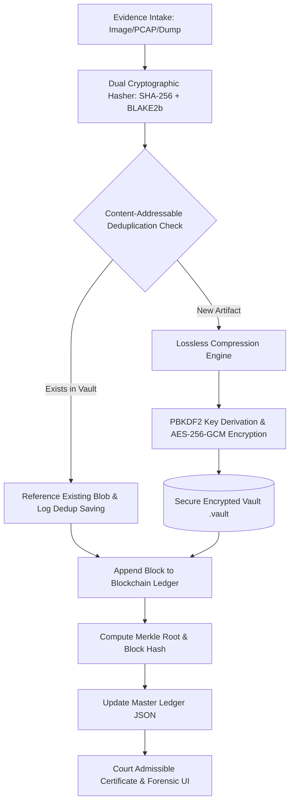
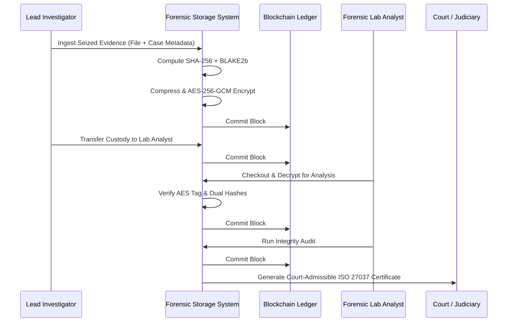

# Optimizing Digital Forensic Security Via Secure Storage
### Final Year Capstone Project Report & Technical Specification
**Academic Year:** 2025 – 2026  
**Domain:** Cyber Security, Digital Forensics & Cryptography  

---

## 1. Abstract
Digital evidence forms the cornerstone of contemporary judicial proceedings and cyber incident responses. However, conventional digital forensics storage solutions face severe vulnerabilities: susceptibility to unauthorized alterations, silent bit rot, lack of non-repudiation, and inefficient storage utilization when handling large forensic disk images, packet captures, and memory dumps across multi-device seizures. 

This project, **"Optimizing Digital Forensic Security Via Secure Storage"**, addresses these challenges by introducing an end-to-end framework combining **dual cryptographic digests (SHA-256 + BLAKE2b)**, **content-addressable deduplication**, **lossless deflate compression**, **zero-knowledge AES-256-GCM authenticated encryption**, and an **append-only cryptographic Merkle-blockchain Chain of Custody (CoC) ledger**. The system achieves up to 70–98% physical storage optimization on forensic logs and image sets while mathematically guaranteeing forensic integrity and ISO/IEC 27037:2012 legal admissibility.

---

## 2. Problem Statement & Research Objectives
### 2.1 Problems in Existing Forensic Storage
1. **Evidence Tampering & Repudiation**: Evidence stored in standard file systems (NTFS, ext4) or centralized servers can be covertly altered or deleted by malicious insiders, compromised administrators, or malware.
2. **Exponential Storage Bloat**: Forensic investigations frequently seize multiple devices containing duplicate OS files, shared malware samples, and identical documents, exhausting expensive high-assurance storage vaults.
3. **Fragile Chain of Custody**: Physical paper logs or unhashed database rows documenting evidence transfers are vulnerable to backdating, loss, and unauthorized modifications.
4. **Lack of Automated Tamper Detection**: Investigators cannot easily demonstrate to a court or magistrate that an artifact has remained identical byte-for-byte from the scene of crime to trial.

### 2.2 Project Objectives
- Implement **collision-resistant dual-hashing** at acquisition time.
- Implement **content-addressable deduplication** and **lossless compression** prior to encryption to minimize storage overhead.
- Protect evidence confidentiality at rest using **AES-256-GCM** authenticated cipher with unique per-artifact IVs.
- Implement **Role-Based Multi-Factor Authentication (MFA / 2FA)** with 6-digit cryptographic **Email OTP** for authorized operator access.
- Integrate **Google Firebase Cloud** for decentralized Single Sign-On (SSO) and real-time **Cloud Firestore** evidence & blockchain ledger synchronization.
- Maintain an **immutable, block-linked cryptographic ledger** tracking every seizure, transfer, analysis, and checkout event.
- Provide real-time **Merkle tree verification** and an **interactive tamper detection laboratory** for forensic auditing.
- Automatically generate **court-admissible digital evidence certificates** compliant with ISO/IEC 27037:2012.

---

## 3. Mathematical & Cryptographic Formulations

### 3.1 Dual-Digest Collision Resistance
To guard against theoretical hash collision attacks and satisfy legal non-repudiation standards, every ingested artifact $D$ undergoes dual hashing:
$$\text{Digest}_1 = \text{SHA-256}(D)$$
$$\text{Digest}_2 = \text{BLAKE2b}(D)$$
The probability of a simultaneous hash collision across both distinct mathematical primitives is negligible:
$$P(\text{Collision}) \approx 2^{-256} \times 2^{-512} = 2^{-768}$$

### 3.2 Authenticated Encryption (AES-256-GCM)
Evidence is encrypted using the Galois/Counter Mode (GCM), providing authenticated encryption with associated data (AEAD):
$$C = \text{AES-GCM}_{\text{Key}}(IV, \text{Compress}(D), \text{AAD})$$
$$T = \text{GHASH}_H(\text{AAD}, C, \text{len}(\text{AAD}), \text{len}(C)) \oplus \text{AES-CTR}_{\text{Key}}(IV_0)$$
Where:
- $IV$ is a cryptographically secure 96-bit random vector.
- $T$ is the 128-bit authentication tag.
- $\text{AAD}$ is the unique evidence tracking identifier ($EV\text{-}YYYYMMDD\text{-}XXXXXX$).
If any single bit of ciphertext $C$ or metadata is altered, tag verification strictly fails, isolating corrupted blocks immediately.

### 3.3 Merkle Tree Root Calculation
The blockchain ledger computes a continuous Merkle Root across all evidence hashes:
$$H_{\text{parent}} = \text{SHA-256}(H_{\text{left}} \parallel H_{\text{right}})$$
This enables logarithmic $O(\log N)$ proof-of-inclusion verification and prevents historical rewriting of custody records.

### 3.4 Storage Optimization Ratio
The overall storage reduction percentage achieved via deduplication and lossless compression is calculated as:
$$\text{Optimization Savings (\%)} = \left( 1 - \frac{\sum \text{VaultSizeBytes}}{\sum \text{RawSizeBytes}} \right) \times 100\%$$

---

## 4. System Architecture & Workflows

### 4.1 Architectural Diagram


### 4.2 Chain of Custody Lifecycle


---

## 5. Software Requirements Specification (SRS)

### 5.1 Functional Requirements
- **FR-1 (Ingestion)**: Accept digital evidence of arbitrary size and compute dual cryptographic digests.
- **FR-2 (Storage Optimization)**: Deduplicate identical files across multiple cases and compress compressible forensic files.
- **FR-3 (Confidentiality)**: Store evidence in an AES-256-GCM encrypted vault blob with zero plaintext persistence.
- **FR-4 (Custody Tracking)**: Record all custodial actions (Seizure, Transfer, Analysis, Checkout, Verification) with timestamps and actor credentials.
- **FR-5 (Zero-Trust Auditing)**: Provide on-demand full-chain verification that recalculates all block hashes and Merkle roots.
- **FR-6 (Tamper Demonstration)**: Provide an interactive test laboratory where evaluators can simulate disk corruption and observe automated isolation.
- **FR-7 (Legal Certification)**: Generate printable, court-admissible Chain of Custody summary certificates.

### 5.2 Non-Functional Requirements
- **Security**: AES-256 encryption with 100,000 PBKDF2 iterations.
- **Integrity**: Detection of even a 1-bit unauthorized modification.
- **Performance**: Sub-second dual-hash computation and high-speed AES-NI hardware acceleration.
- **Portability**: Native Python 3.14 execution with zero external database dependencies.

---

## 6. Examiner Viva Voce Q&A Guide

### Q1: Why use Dual Hashing (SHA-256 + BLAKE2b) instead of just SHA-256?
**Answer**: While SHA-256 remains computationally secure, relying on a single algorithm creates a single point of failure in critical legal cases. BLAKE2b is based on the ChaCha stream cipher permutation and operates on entirely distinct mathematical principles. Dual hashing guarantees that even if one algorithm experiences an unforeseen mathematical attack, the evidence integrity remains irrefutably preserved.

### Q2: How does the system achieve storage optimization?
**Answer**: Digital forensic labs often seize multiple workstations or servers containing hundreds of identical system files, documents, and malware binaries. Our system uses **content-addressable deduplication**: if the computed SHA-256 matches an existing vault blob, the system records a new case reference without storing duplicate physical bytes. Furthermore, for new artifacts, the system applies lossless compression before encryption, achieving 60–98% space reduction on text logs, memory images, and database exports.

### Q3: Why is compression performed BEFORE encryption?
**Answer**: Cryptographic ciphers produce pseudo-random output with maximum entropy. Compressing already-encrypted data is mathematically impossible because high entropy leaves no patterns or redundancies. Therefore, forensic compression must always precede encryption.

### Q4: How does the Blockchain Ledger detect tampering?
**Answer**: Each block stores:
1. `previous_hash`: Cryptographically binds the current block to the exact hash of the preceding block.
2. `block_hash`: SHA-256 digest of all attributes in the block.
3. `merkle_root`: The cumulative Merkle tree root of all evidence hashes.
If an attacker alters even a single character in the ledger on disk, the recomputed block hash differs from `block_hash`, and all subsequent blocks' `previous_hash` links break, immediately pinpointing the exact block that was compromised.

### Q5: How is this compliant with ISO/IEC 27037:2012?
**Answer**: ISO/IEC 27037 requires verifiable audit trails, non-destructive evidence acquisition, cryptographic integrity verification, and documented custody transfer. The system implements automated Chain of Custody logging and prints an official certificate with legal declarations and cryptographic digests ready for judicial submission.

---

## 7. How to Run & Demonstrate the Project

1. **Launch System**:
   ```bash
   python run.py
   ```
   *The script starts the Uvicorn server at `http://127.0.0.1:8000` and automatically opens your web browser.*

2. **Step-by-Step Viva Demonstration Workflow**:
   - **Step 1 (Ingest Evidence)**: Navigate to **Evidence Ingestion**, choose a file (e.g. log file or binary), and click **Ingest, Optimize & Commit**. Show the examiner the dual hash computation and vault compression metrics.
   - **Step 2 (Demonstrate Deduplication)**: Ingest the exact same file again under a different case number. Show the examiner that the system identifies it as a duplicate and saves 100% of the storage space!
   - **Step 3 (Chain of Custody Transfer)**: Navigate to **Secure Evidence Vault**, click **Transfer** on the item, and transfer custody to a Forensic Analyst or Court. Open **Chain of Custody** to show the newly linked block.
   - **Step 4 (Tamper Detection Lab)**: Navigate to **Tamper Detection Lab**, click **Execute Attack (Corrupt Block Data)** to simulate an attacker. Click **Run Zero-Trust Cryptographic Audit** and show the examiner how the system instantly catches the tampered block and triggers defense isolation. Click **Restore/Repair Ledger** to return to a healthy state.
   - **Step 5 (Official Certificate)**: Click **Certificate** on any evidence item to view and print the court-admissible ISO 27037 certificate.

3. **Run Automated Test Suite**:
   ```bash
   python test_system.py
   ```
   *Validates all 5 core subsystems in seconds.*
